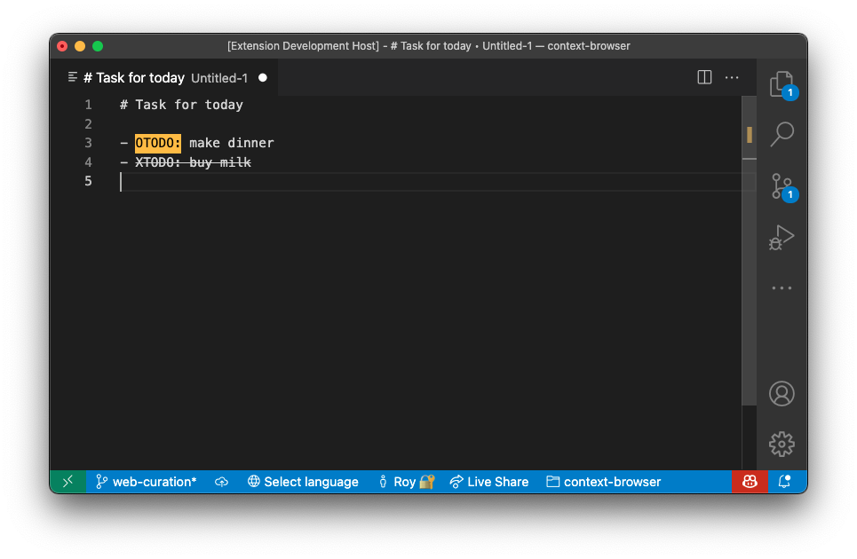

# XOTODO

xotodo is a protoype task management system. This extension will provide syntax highlighting for the task notation.

## Features

Highlighting open and closed TODOs:

## Requirements

No requirements, but check out [xotodo](https://github.com/royru/xotodo) 

## Extension Settings

This extension does not contribute any settings at the moment.
<!-- Include if your extension adds any VS Code settings through the `contributes.configuration` extension point.

For example:

This extension contributes the following settings:

* `myExtension.enable`: enable/disable this extension
* `myExtension.thing`: set to `blah` to do something -->

## Known Issues

None

## Roadmap
- OTODO: add current logo
- OTODO: click on open-todo-keyword should set the todo to closed and add a completion date.

## Release Notes

### 0.0.1
Initial release of xotodo

### 0.0.2
- small refactoring of the code
- changed the design of `XTODO:` to not cross the whole line anymore, but only the keyword
- added a completion provider for due dates (triggered with `@`) on lines comprising the open-todo-keyword.
